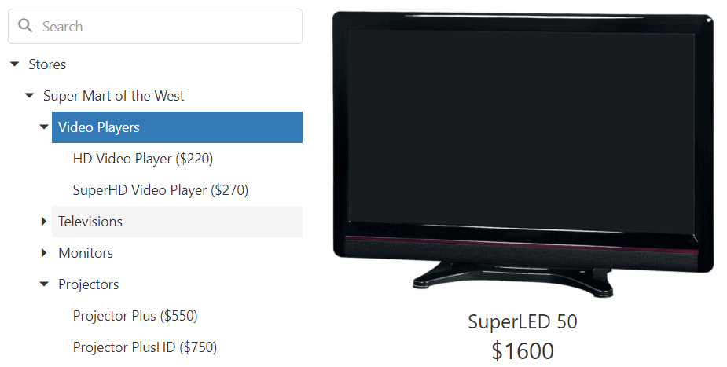

<!-- default badges list -->

<!-- default badges end -->
# DevExtreme TreeView - Getting Started 

This repository stores code examples of the TreeView component for the [Getting Started with TreeView](https://js.devexpress.com/Documentation/Guide/UI_Components/TreeView/Getting_Started_with_TreeView/) tutorial. The TreeView component displays a tree of text nodes from a local or remote source. This tutorial shows how to add the TreeView to a page, bind it to data, and configure its core features.

## Files to Review

- **Angular**
    - [app.component.html](angular/src/app/app.component.html)
    - [app.component.ts](angular/src/app/app.component.ts)
- **jQuery**
    - [index.js](jQuery/index.js)
- **React**
    - [App.js](react/src/App.js)
- **Vue**
    - [App.vue](vue/src/App.vue)

## Documentation

- [Getting Started with TreeView](https://js.devexpress.com/Documentation/Guide/UI_Components/TreeView/Getting_Started_with_TreeView/)

- [TreeView - API Reference](https://js.devexpress.com/Documentation/ApiReference/UI_Components/dxTreeView/)

<!-- feedback -->
## Does this example address your development requirements/objectives?

 

(you will be redirected to DevExpress.com to submit your response)
<!-- feedback end -->
